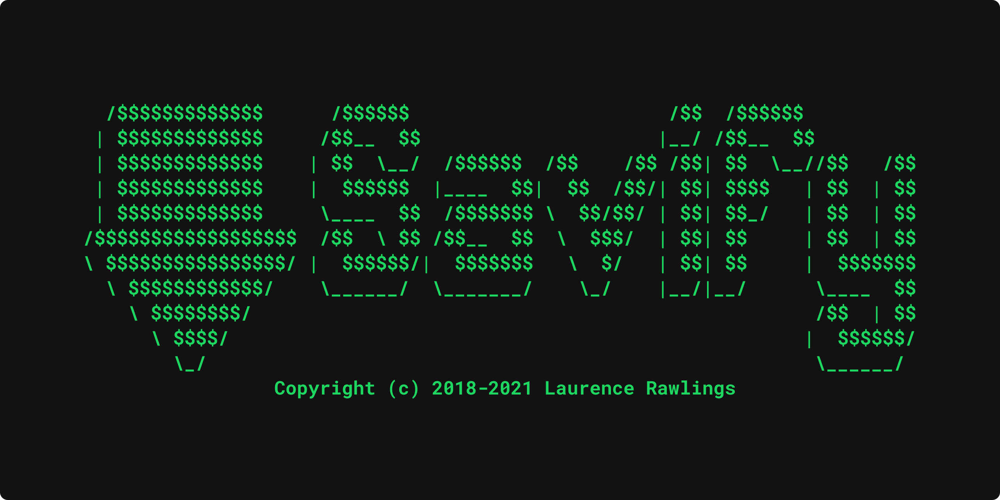

======
Savify
======

.. image:: https://img.shields.io/pypi/v/savify.svg?style=for-the-badge
        :target: https://pypi.python.org/pypi/savify
        :alt: PyPi

.. image:: https://img.shields.io/travis/LaurenceRawlings/savify.svg?style=for-the-badge
        :target: https://travis-ci.org/github/LaurenceRawlings/savify
        :alt: Build

.. image:: https://img.shields.io/readthedocs/savify?style=for-the-badge
     :target: https://savify.readthedocs.io
     :alt: Documentation Status

.. image:: https://img.shields.io/github/v/release/laurencerawlings/savify?include_prereleases&style=for-the-badge
     :target: https://github.com/laurencerawlings/savify/releases
     :alt: Release

.. image:: https://img.shields.io/github/downloads-pre/laurencerawlings/savify/latest/total?style=for-the-badge
     :target: https://github.com/laurencerawlings/savify/releases
     :alt: Downloads

.. image:: https://img.shields.io/discord/701075588466737312?style=for-the-badge
     :target: https://discordapp.com/invite/SPuPEda
     :alt: Discord

.. image:: https://img.shields.io/github/stars/laurencerawlings/savify?style=for-the-badge
     :target: https://github.com/laurencerawlings/savify/stargazers
     :alt: Stars

.. image:: https://img.shields.io/github/contributors/laurencerawlings/savify?style=for-the-badge
     :target: https://github.com/laurencerawlings/savify/graphs/contributors
     :alt: Contributors

.. image:: https://pyup.io/repos/github/LaurenceRawlings/savify/shield.svg?style=for-the-badge
     :target: https://pyup.io/repos/github/LaurenceRawlings/savify/
     :alt: Updates

Savify
======

`Savify <https://github.com/LaurenceRawlings/savify>`__ is a python
library that downloads songs from Spotify. Given a query, Savify will find
and downlod songs to mp3 format with quality as high as **320 kb/s**! 
The application will also scrape and write **id3v2 tags** to all of your 
songs. Tags include: **title, artists, year, album and even cover-art!**

Savify supports all Spotify track, album and playlist links. Additionally,
there is an **integrated search function** so even if you don't have the
Spotify link you can simply enter song name and Savify will download it!

As well as mp3, Savify can also download and convert to other file types. 
Inside the application, you can specify which format and quality you would 
like to download the song in for maximum compatibility across all of your 
devices. Available formats: mp3, aac, flac, m4a, opus, vorbis, and wav. 
**Tags and cover art will only be applied to songs downloaded in mp3 format.**

FFmpeg
------

Savify relies on the open source FFmpeg library in order to convert and
write metadata to the songs it downloads. Please make sure FFmpeg is
installed on your computer and added to the System PATH. Follow the tutorial 
`here <https://github.com/adaptlearning/adapt_authoring/wiki/Installing-FFmpeg>`__.

Playlists
=========

If you want to use Savify to download personal Spotify playlists ensure their 
visibility is set to 'Public'. This is so Savify can use the Spotify API to 
retrieve the song details from your playlist.

Installation
============

If you are on Windows tyou can doqnload the latest pre-packed executable 
package (which I recommend as you will not have to provide a Savify API key), 
or you can download the python library and run the module directly using the CLI.

Download the latest release `(coming soon)`
-------------------------------------------

Go `here <https://github.com/TechifyUK/savify/releases>`__ to download
the latest Savify.exe then make sure you have FFmpeg downloaded and it
added to your PATH as per the section above.

That's it, you should be good to go! See some usage examples below.

Using the Python module
-----------------------

``$ pip install -U savify``

`CLI COMING SOON`

Usage
=====

Currently Savify only supports Spotify URLs and search queries,
however support for Spotify URIs will be added in the future.

Download Defaults
-----------------

:Query Type: track
:Quality: best
:Format: mp3
:Path:
     Windows: HOME/AppData/Roaming/Savify/downloads

     Linux: HOME/.local/share/Savify/downloads

     MacOS: HOME/Library/Application Support/Savify/downloads
:Grouping: no grouping

For more usage examples read the `docs <https://savify.readthedocs.io>`__.

Spotify Application
-------------------

To use the Savify Python module you will need your own Spotify
developer application to access their API. To do this sign up
`here <https://developer.spotify.com/>`__. When you have made a new
application take note of your client id and secret. You can pass
the id and secret to Savify in two ways:

Environment variables (reccommended)
~~~~~~~~~~~~~~~~~~~~~~~~~~~~~~~~~~~~

Now you need to add 2 environment variables to your system:

``SPOTIPY\_CLIENT\_ID``

``SPOTIPY\_CLIENT\_SECRET``

To find out how to do this find a tutorial online for your specific
operating system. Once you have done this make sure to restart your
shell.

During object instantiation
~~~~~~~~~~~~~~~~~~~~~~~~~~~

You can pass in your id and secret using a tuple when creating your
Savify object:

.. code-block:: python

     s = Savify(api_credentials=("CLIENT_ID","CLIENT_SECRET"))

Use in your Python project
--------------------------

Install the package to your environment:

``$ pip install savify``

Import and use Savify:

.. code-block:: python

     from savify import Savify
     from savify.types import Type, Format, Quality

     with Savify() as s:
          # Spotify URL
          s.download("SPOTIFY URL")

          # Search Query
          # Types: TRACK, ALBUM, PLAYLIST
          s.download("QUERY", query_type=Type.TRACK)

Savify optional constructor arguments (se above for defaults):

.. code-block:: python

     from pathlib import Path

     from savify import Savify
     from savify.types import Type, Format, Quality

     # Quality Options: WORST, Q32K, Q96K, Q128K, Q192K, Q256K, Q320K, BEST
     # Format Options: MP3, AAC, FLAC, M4A, OPUS, VORBIS, WAV
     Savify(api_credentials=None, quality=Quality.BEST, download_format=Format.MP3, output_path=Path('path/for/downloads'), group='%artist%/%album%')

The group argument is used to sort you downloaded songs inside the 
output path. Possible varibles for the path string are: %artist%, %album%, 
and %playlist%. The variables are replaced eith the songs metadata.
For example a song downloaded with the above Savify object would
save to a path like this: 
`path/for/downloads/Example Artist/Example Album/Example Song.mp3`

For Developers
==============

If you want to try you hand at adding to Savify use the instructions
`here <CONTRIBUTING.rst>`__. From there you can make any additions you
think would make Savify better.

Tip
---

If you are developing Savify, install the pip package locally so you 
can make and test your changes. From the root directorty run:

``$ pip install -e .``

You can then run the Python module:

``$ savify``

Credits
=======

This package was created with Cookiecutter_ and the `audreyr/cookiecutter-pypackage`_ project template.

.. _Cookiecutter: https://github.com/audreyr/cookiecutter
.. _`audreyr/cookiecutter-pypackage`: https://github.com/audreyr/cookiecutter-pypackage
